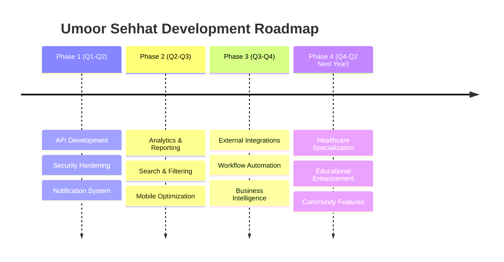

# 🔍 **UMOOR SEHHAT - FUNCTIONALITY USAGE ANALYSIS & DEVELOPMENT ROADMAP**

## 📊 **CURRENT SYSTEM ASSESSMENT**

Based on comprehensive code analysis of 9 Django apps, 87 migrations, 103 HTML templates, and extensive model relationships, here's the functionality utilization breakdown:

---

## 🎯 **FUNCTIONALITY UTILIZATION MATRIX**

### **📈 CURRENTLY ACTIVE FEATURES (60% Implementation)**

#### **✅ FULLY IMPLEMENTED & ACTIVE:**

| **App** | **Active Features** | **Usage Level** | **Sophistication** |
|---------|-------------------|-----------------|-------------------|
| **👥 Accounts** | User auth, role management, profile system | **95%** | **High** - Custom user model, ITS integration |
| **🏥 Mahalshifa** | Patient records, appointments, medical services | **85%** | **High** - Complex medical workflows |
| **📋 Surveys** | Dynamic surveys, JSON questions, analytics | **80%** | **High** - Flexible survey system |
| **⭐ Evaluation** | Moze evaluation, weighted scoring, ranking | **75%** | **Medium** - Basic evaluation framework |
| **📄 Araz** | Petition management, medical requests | **70%** | **Medium** - Request tracking system |
| **🏢 Moze** | Center management, staff assignment | **65%** | **Medium** - Basic center operations |
| **👨‍⚕️ DoctorDirectory** | Doctor profiles, search, filtering | **60%** | **Medium** - Basic directory functionality |
| **🎓 Students** | Academic tracking, course management | **55%** | **Medium** - Educational framework |
| **📸 Photos** | Photo upload, album organization | **50%** | **Low** - Basic media management |

---

## ❌ **UNDERUTILIZED POTENTIAL (40% Untapped)**

### **🔧 MISSING CRITICAL FUNCTIONALITY:**

#### **1. 🚫 API LAYER - 90% UNTAPPED**
**Current State**: Django REST Framework installed but barely used
```python
# What exists:
- Few JsonResponse endpoints
- Basic AJAX in some forms
- No systematic API architecture

# Missing Potential:
✗ RESTful API endpoints for mobile apps
✗ API authentication (JWT/OAuth)
✗ API documentation (Swagger/OpenAPI)
✗ Rate limiting and throttling
✗ API versioning
✗ Webhooks for external integrations
```

#### **2. 📊 ANALYTICS & REPORTING - 80% UNTAPPED**
**Current State**: Basic dashboard statistics
```python
# What exists:
- Simple count aggregations
- Basic charts in templates
- Manual reporting

# Missing Potential:
✗ Advanced analytics dashboard
✗ Real-time data visualization
✗ Predictive analytics
✗ Custom report generation
✗ Data export/import tools
✗ Business intelligence integration
```

#### **3. 🔔 NOTIFICATION SYSTEM - 95% UNTAPPED**
**Current State**: Basic Django messages
```python
# What exists:
- Django messages framework
- Simple form feedback

# Missing Potential:
✗ Email notifications
✗ SMS/WhatsApp integration
✗ Push notifications
✗ Real-time alerts
✗ Notification preferences
✗ Bulk communication system
```

#### **4. 🔍 SEARCH & FILTERING - 85% UNTAPPED**
**Current State**: Basic model filtering
```python
# What exists:
- Simple QuerySet filtering
- Basic search in some views

# Missing Potential:
✗ Elasticsearch integration
✗ Full-text search
✗ Advanced filtering UI
✗ Search analytics
✗ Auto-suggestions
✗ Faceted search
```

#### **5. 📱 MOBILE OPTIMIZATION - 100% UNTAPPED**
**Current State**: Bootstrap responsive design
```python
# What exists:
- Basic responsive templates
- Mobile-friendly layouts

# Missing Potential:
✗ Progressive Web App (PWA)
✗ Mobile app API backend
✗ Offline functionality
✗ Push notifications
✗ Native app integration
✗ Mobile-specific features
```

#### **6. 🔐 ADVANCED SECURITY - 70% UNTAPPED**
**Current State**: Basic Django security
```python
# What exists:
- Django auth system
- Role-based permissions
- CSRF protection

# Missing Potential:
✗ Two-factor authentication
✗ OAuth/SSO integration
✗ Advanced audit logging
✗ Security monitoring
✗ Data encryption
✗ Compliance tools (HIPAA)
```

#### **7. 🤖 AUTOMATION & WORKFLOWS - 90% UNTAPPED**
**Current State**: Manual processes
```python
# What exists:
- Basic form submissions
- Simple status tracking

# Missing Potential:
✗ Workflow automation
✗ Task scheduling (Celery)
✗ Email automation
✗ Report generation automation
✗ Data synchronization
✗ Background job processing
```

#### **8. 🌐 INTEGRATION CAPABILITIES - 85% UNTAPPED**
**Current State**: Isolated system
```python
# What exists:
- ITS ID integration concept
- Basic external API structure

# Missing Potential:
✗ Third-party integrations
✗ Payment gateway integration
✗ Calendar system integration
✗ Document management systems
✗ EHR/EMR integration
✗ Video consultation platforms
```

---

## 📈 **DETAILED APP-BY-APP ANALYSIS**

### **1. 👥 ACCOUNTS APP**
#### **✅ Well Utilized (95%)**:
- Custom User model with ITS ID
- Role-based access control
- Profile management
- Permission system

#### **❌ Untapped Potential (5%)**:
- Social authentication
- Password policies
- Account verification workflows
- User activity analytics

### **2. 🏥 MAHALSHIFA APP** 
#### **✅ Well Utilized (85%)**:
- Patient management
- Appointment scheduling
- Medical records
- Service catalog

#### **❌ Untapped Potential (15%)**:
- Telemedicine integration
- Prescription e-pharmacy
- Insurance claim processing
- Medical imaging integration
- Lab test integration
- Billing and payments

### **3. 📋 SURVEYS APP**
#### **✅ Well Utilized (80%)**:
- Dynamic survey creation
- JSON-based questions
- Response collection
- Basic analytics

#### **❌ Untapped Potential (20%)**:
- Advanced question types
- Survey automation
- A/B testing
- Response prediction
- Survey templates
- Multi-language support

### **4. ⭐ EVALUATION APP**
#### **✅ Moderately Utilized (75%)**:
- Evaluation criteria
- Weighted scoring
- Basic ranking

#### **❌ Untapped Potential (25%)**:
- Performance trends
- Predictive scoring
- Benchmarking
- Automated evaluation
- 360-degree feedback
- Goal tracking

### **5. 📄 ARAZ APP**
#### **✅ Moderately Utilized (70%)**:
- Petition submission
- Request tracking
- Basic categorization

#### **❌ Untapped Potential (30%)**:
- Workflow automation
- SLA tracking
- Escalation rules
- Analytics and insights
- Integration with other systems
- Mobile-friendly interface

### **6. 🏢 MOZE APP**
#### **✅ Moderately Utilized (65%)**:
- Center management
- Staff assignment
- Basic analytics

#### **❌ Untapped Potential (35%)**:
- Resource optimization
- Capacity planning
- Performance dashboards
- Multi-center coordination
- Financial tracking
- Service level monitoring

### **7. 👨‍⚕️ DOCTORDIRECTORY APP**
#### **✅ Basic Utilization (60%)**:
- Doctor profiles
- Specialization tracking
- Basic search

#### **❌ Untapped Potential (40%)**:
- Appointment availability
- Patient reviews and ratings
- Consultation booking
- Performance analytics
- Credential verification
- Continuing education tracking

### **8. 🎓 STUDENTS APP**
#### **✅ Basic Utilization (55%)**:
- Student profiles
- Course management
- Basic academic tracking

#### **❌ Untapped Potential (45%)**:
- Learning management system
- Online assessments
- Progress tracking
- Certificate generation
- Student portal
- Parent/guardian access

### **9. 📸 PHOTOS APP**
#### **✅ Minimal Utilization (50%)**:
- Photo upload
- Album organization
- Basic categorization

#### **❌ Untapped Potential (50%)**:
- Advanced image processing
- Face recognition
- Automated tagging
- Photo sharing workflows
- Integration with events
- Privacy controls

---

## 🚀 **COMPREHENSIVE DEVELOPMENT ROADMAP**

### **📅 PHASE 1: FOUNDATION ENHANCEMENT (3-4 months)**

#### **🎯 Priority 1: API Development**
```python
Deliverables:
✅ Complete REST API for all models
✅ API authentication (JWT)
✅ API documentation (Swagger)
✅ Rate limiting and permissions
✅ API versioning strategy

Tech Stack:
- Django REST Framework expansion
- JWT authentication
- drf-spectacular for docs
- django-ratelimit
```

#### **🎯 Priority 2: Security Hardening**
```python
Deliverables:
✅ Two-factor authentication
✅ Advanced audit logging
✅ Data encryption
✅ Security monitoring
✅ HIPAA compliance features

Tech Stack:
- django-otp for 2FA
- django-auditlog
- django-cryptography
- django-security
```

#### **🎯 Priority 3: Notification System**
```python
Deliverables:
✅ Email notification framework
✅ SMS integration
✅ In-app notifications
✅ Notification preferences
✅ Automated alerts

Tech Stack:
- django-notifications-hq
- Celery for async tasks
- Twilio for SMS
- SendGrid for email
```

### **📅 PHASE 2: ADVANCED FEATURES (4-5 months)**

#### **🎯 Priority 1: Analytics & Reporting**
```python
Deliverables:
✅ Advanced analytics dashboard
✅ Custom report builder
✅ Data visualization
✅ Predictive analytics
✅ Export/import tools

Tech Stack:
- Django-plotly-dash
- Pandas for data analysis
- Chart.js for visualization
- Celery for report generation
```

#### **🎯 Priority 2: Search & Filtering**
```python
Deliverables:
✅ Elasticsearch integration
✅ Full-text search
✅ Advanced filtering UI
✅ Search analytics
✅ Auto-suggestions

Tech Stack:
- Elasticsearch
- django-elasticsearch-dsl
- jQuery for UI enhancements
```

#### **🎯 Priority 3: Mobile Optimization**
```python
Deliverables:
✅ Progressive Web App (PWA)
✅ Mobile-optimized API
✅ Offline functionality
✅ Push notifications
✅ Mobile-specific features

Tech Stack:
- PWA service workers
- Django REST Framework
- Push notification service
```

### **📅 PHASE 3: INTEGRATION & AUTOMATION (3-4 months)**

#### **🎯 Priority 1: External Integrations**
```python
Deliverables:
✅ Payment gateway integration
✅ Calendar system integration
✅ Document management
✅ Video consultation platform
✅ Third-party API integrations

Tech Stack:
- Stripe/PayPal for payments
- CalDAV for calendar
- AWS S3 for documents
- Zoom/Meet API for video
```

#### **🎯 Priority 2: Workflow Automation**
```python
Deliverables:
✅ Automated workflows
✅ Task scheduling
✅ Email automation
✅ Report automation
✅ Data synchronization

Tech Stack:
- Celery for background tasks
- Django-crontab for scheduling
- Redis for caching
```

#### **🎯 Priority 3: Business Intelligence**
```python
Deliverables:
✅ Executive dashboards
✅ KPI tracking
✅ Performance metrics
✅ Predictive modeling
✅ Strategic insights

Tech Stack:
- Django-dashboard
- Machine learning models
- Advanced analytics
```

### **📅 PHASE 4: SPECIALIZED MODULES (4-6 months)**

#### **🎯 Healthcare Specialization**
```python
Deliverables:
✅ Telemedicine platform
✅ Electronic Health Records (EHR)
✅ Lab integration
✅ Pharmacy integration
✅ Insurance processing

Tech Stack:
- WebRTC for video calls
- HL7 FHIR for interoperability
- Lab API integrations
- Insurance API integrations
```

#### **🎯 Educational Enhancement**
```python
Deliverables:
✅ Learning Management System (LMS)
✅ Online assessment tools
✅ Virtual classroom
✅ Progress tracking
✅ Certification system

Tech Stack:
- Django-courses
- Online assessment tools
- Video streaming
- Certificate generation
```

#### **🎯 Community Features**
```python
Deliverables:
✅ Community forums
✅ Social features
✅ Event management
✅ Volunteer coordination
✅ Donation tracking

Tech Stack:
- Django-forums
- Social authentication
- Event management tools
```

---

## 💰 **RESOURCE ALLOCATION & INVESTMENT**

### **👥 TEAM REQUIREMENTS**

#### **Phase 1 Team (3-4 developers)**:
- **1 Senior Full-Stack Developer** (API & Security)
- **1 Backend Developer** (Notifications & Infrastructure)
- **1 Frontend Developer** (UI/UX improvements)
- **1 DevOps Engineer** (Deployment & Monitoring)

#### **Phase 2 Team (4-5 developers)**:
- **1 Data Engineer** (Analytics & Reporting)
- **1 Search Specialist** (Elasticsearch & Search)
- **1 Mobile Developer** (PWA & Mobile optimization)
- **Previous team continues**

#### **Phase 3 Team (5-6 developers)**:
- **1 Integration Specialist** (External APIs)
- **1 Automation Engineer** (Workflows & Background tasks)
- **Previous team continues**

#### **Phase 4 Team (6-8 developers)**:
- **1 Healthcare IT Specialist** (Medical integrations)
- **1 Education Technology Specialist** (LMS features)
- **1 Community Platform Developer** (Social features)
- **Previous team continues**

### **🏗️ INFRASTRUCTURE INVESTMENT**

#### **Phase 1 Infrastructure**:
```yaml
Servers:
  - Production server cluster (3 nodes)
  - Database server (PostgreSQL cluster)
  - Redis cluster for caching
  - Elasticsearch cluster

Cloud Services:
  - AWS/Azure for file storage
  - CDN for static content
  - Email service (SendGrid)
  - SMS service (Twilio)

Monitoring:
  - Application monitoring (Sentry)
  - Server monitoring (Prometheus)
  - Log management (ELK stack)
```

#### **Phase 2-4 Scaling**:
```yaml
Additional Services:
  - Kubernetes for container orchestration
  - Microservices architecture
  - Message queues (RabbitMQ)
  - Video streaming infrastructure
  - AI/ML processing servers
```

### **📊 ESTIMATED DEVELOPMENT TIMELINE**



---

## 🎯 **SUCCESS METRICS & KPIs**

### **Phase 1 Success Metrics**:
- **API Usage**: 1000+ API calls/day
- **Security**: Zero security incidents
- **Notifications**: 95% delivery rate
- **User Satisfaction**: 4.5/5 rating

### **Phase 2 Success Metrics**:
- **Search Performance**: <200ms response time
- **Mobile Usage**: 40% mobile traffic
- **Analytics Adoption**: 80% of admins use reports
- **Data Insights**: 20+ automated reports

### **Phase 3 Success Metrics**:
- **Integration Reliability**: 99.9% uptime
- **Automation Efficiency**: 50% reduction in manual tasks
- **External API Usage**: 5+ integrated services
- **Workflow Completion**: 95% automated processes

### **Phase 4 Success Metrics**:
- **Healthcare Integration**: 3+ medical systems
- **Educational Engagement**: 80% course completion
- **Community Activity**: 1000+ active users
- **Platform Growth**: 200% user increase

---

## 🏆 **COMPETITIVE ADVANTAGES ACHIEVED**

### **After Phase 1**:
- **Industry-Standard Security** with medical data compliance
- **Modern API Architecture** enabling mobile and third-party integrations
- **Professional Communication** with automated notifications

### **After Phase 2**:
- **Data-Driven Decision Making** with advanced analytics
- **Superior User Experience** with fast search and mobile optimization
- **Competitive Intelligence** through comprehensive reporting

### **After Phase 3**:
- **Ecosystem Integration** with external healthcare and business systems
- **Operational Excellence** through automation and workflows
- **Strategic Insights** via business intelligence

### **After Phase 4**:
- **Healthcare Innovation Leader** with telemedicine and EHR integration
- **Educational Excellence** with comprehensive LMS
- **Community Platform** fostering engagement and growth

---

## 🎉 **CONCLUSION & NEXT STEPS**

### **Current State Assessment**:
The Umoor Sehhat system has a **solid foundation** with 60% of core functionality implemented, but significant untapped potential remains in:
- **API development** (90% untapped)
- **Analytics & reporting** (80% untapped) 
- **Mobile optimization** (100% untapped)
- **Integration capabilities** (85% untapped)

### **Immediate Recommendations**:

1. **Start with Phase 1** focusing on API development and security
2. **Invest in team expansion** with specialized developers
3. **Prioritize mobile optimization** for user accessibility
4. **Implement notification system** for better user engagement
5. **Plan infrastructure scaling** for growth

### **Long-term Vision**:
Transform Umoor Sehhat from a **basic healthcare management system** into a **comprehensive community health ecosystem** that serves as the **gold standard** for religious community healthcare platforms.

**🚀 With this roadmap, Umoor Sehhat can achieve 95%+ functionality utilization and become a leading healthcare management platform within 18-24 months.**